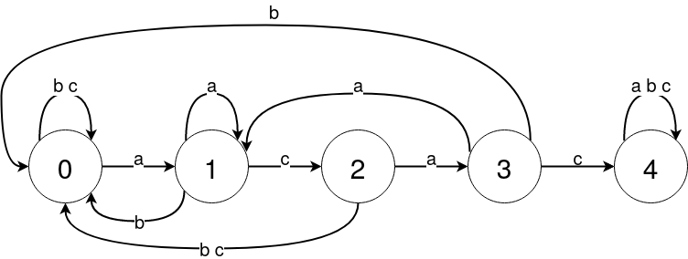

# List 3
---
## Advanced combinatorics course at Wroclaw University of Science and Technology 2020/2021
---
## Deadline: 
30.11.2020

### Exercise 1 (5 points)
#### Let  be the language over the alphabet $\{a, b, c\}$ composed of words that contain pattern $acac$. Describe the appropriate finite automata and present the `OFG` for $\mathcal{L}$.

Having patern of length 4 finite automa has 5 stages. They are connected by following letters from string, different letters are conected to "lower" stages. After reaching 4th stage we stay in it even after appending aditional letters.


```python
from IPython.display import Image
from IPython.core.display import HTML 
Image(filename = "./Rys_1_Cw_3.png", width=600, height=200)
```





To calculate OGF for class $\mathcal{L}$. Let first how lanugages $\mathcal{L_0}$, .., $\mathcal{L_4}$ are connected toghether.

$$\begin{equation}
\mathcal{L_0}=a*\mathcal{L_1}+b*\mathcal{L_0}+c*\mathcal{L_0}\\
\mathcal{L_1}=a*\mathcal{L_1}+b*\mathcal{L_0}+c*\mathcal{L_2}\\
\mathcal{L_2}=a*\mathcal{L_3}+b*\mathcal{L_0}+c*\mathcal{L_0}\\
\mathcal{L_3}=a*\mathcal{L_1}+b*\mathcal{L_0}+c*\mathcal{L_4}\\
\mathcal{L_4}=a*\mathcal{L_4}+b*\mathcal{L_4}+c*\mathcal{L_4} +  \varepsilon 
\end{equation}$$

This gives rise to a set of equations for the associated OGFs

\begin{equation}
L_0=z*L_0+2z*L_0\\
L_1=z*L_0+b*z*L_1+z*L_2\\
L_2=2z*L_0+z*L_3\\
L_3=z*L_0+z*L_1+z*L_4\\
L_4=3z*L_4 +1 
\end{equation}

And after a lot of algebraic transformations we get

$$L_0= \frac{ z^4}{(3z-1)(z^4-3z^3+z^2-3z+1)} $$

### Exercise 2 (4 points)
#### How many words of length n are over the alphabet $\mathcal{A}=\{a, b, c, d, e, f, g\}$ that contain the block pattern $\mathbb{p}=aabbaa$?

To calculate number of words containing pattern $'aabbaa'$ we can subtract the number not containing pattern from all.

We can calculate number of words not containg pattern using formula
$$S(z) = \frac{c(z)}{ (z^k+(1-m*z)*c(z))}$$

Where: 

$\textbf{m}$ is alphabet size $(|\mathcal{A}|=6)$, 

$\textbf{k}$ is pattern length $(|\mathbb{p}|=6)$,

$\textbf{c(z)}$ is the autocorrelation polynomial of pattern, equal to $c(z)= \sum_{j=0}^{k-1}c_j*z^j$

Where $c_i=\|p_{i+1}p_{i+2}...p_{k}=p_1p_2...p_{k-i}\|$ equals $1$ or $0$

$a,a,b,b,a,a\\
\phantom{}a,a,b,b,a,a\phantom{,a,a,a,a,a,a}=1\\
\phantom{a,}a,a,b,b,a,a\phantom{a,a,a,a,a,a}=0\\
\phantom{a,a,}a,a,b,b,a,a\phantom{a,a,a,a,a}=0\\
\phantom{a,a,a,}a,a,b,b,a,a\phantom{a,a,a,a}=0\\
\phantom{a,a,a,a,}a,a,b,b,a,a\phantom{a,a,a}=1\\
\phantom{a,a,a,a,a,}a,a,b,b,a,a\phantom{a,a}=1\\
$

$\textbf{c(z)} = 1 + z^4+z^5$

We need also number of words of size n, with equals to $m^n$. So finaly the number of words containing pattern equals to $$[z^n]\mathcal{A_p}=\frac{1}{1-6*z}-\frac{1 + z^4+z^5}{ (z^6+(1-6*z)*(1+ z^4+z^5)}$$

### Exercise 3 (3 points)
#### Apply Lagrange inversion theorem to calculate the coefficient with the term $z^n$ for the function $L(z)$, which is a solution of the equation $$\frac{L(z)}{z}=1+(L(z))^3.$$

### Exercise 4 (4 points)
#### Write the formula `OFG` $S^{(4)}(z)$ such that the coefficient for $z^n$ will be a Stirling number II of the type $S(n, 4)$ that is $[z^n]S^{(4)}(z) = S(n, 4)$.

$S^{(r)}(z)$ is defined as 
$$b_1·SEQ(b_1)·b2·SEQ(b_1+b_2)·b_3·SEQ(b_1 +b_2 +b_3)···b_r·SEQ(b_1+b_2+···+b_r)$$

The language specification immediately gives the OGF
$$S^{(r)}(z)=\frac{z^r}{(1-z)(1-2z)(1-3z)*...*(1-rz)}$$

The partial fraction expansion of S(r)(z) is then readily computed,
$$S^{(r)}(z)=\frac{1}{r!}\sum_{j=0}^{r}\frac{(-1)^{r-j}}{1-jz}$$

And for $r=4$ it evaluates to
$$S^{(4)}(z)=(1+
\frac{1}{24(1-z)(1-2z)(1-3z)(1-4z)})$$


```python

```
